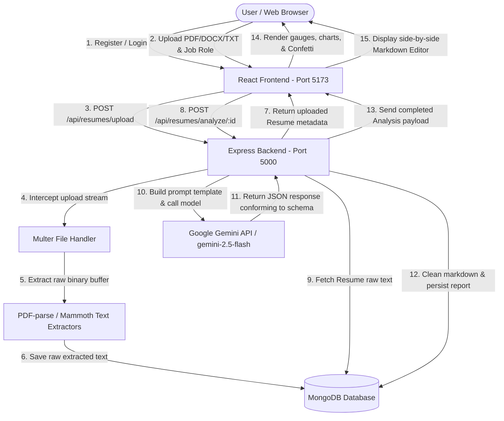

# 📊 SkillMetric — AI-Powered Resume Analyzer & ATS Optimizer

SkillMetric is a state-of-the-art, full-stack web application designed to help job seekers audit, grade, and optimize their resumes against specific target job descriptions. By uploading a resume in PDF, DOCX, or plain text formats, users receive instant, actionable, and visually rich ATS compatibility scores, detailed category breakdowns, keyword analysis, bullet-point rewrites based on Google's X-Y-Z formula, and an automated Markdown resume rewritten to maximize parser readability.

---

## 🚀 Key Features

*   **Secure Authentication & Personal History**: Register and login with JWT-based sessions. Keep a persistent history of every resume uploaded and all analysis runs.
*   **Multi-Format File Parsing**: Upload `.pdf`, `.docx`, or `.txt` resumes directly. The system extracts raw text safely on the server side.
*   **ATS Compatibility Grading**: Evaluates resumes on a scale of 0 to 100 with breakdowns across four core categories: *Formatting*, *Keywords*, *Impact*, and *Structure*.
*   **Dynamic Data Visualizations**: Displays scores in animated circular gauges and high-fidelity Radar/Doughnut charts.
*   **Google's X-Y-Z Bullet Point Re-writer**: Identifies weak resume bullet points and rewrites them into high-impact, quantified achievement statements: **"Accomplished [X], as measured by [Y], by doing [Z]"**.
*   **Gemini AI-Powered Resume Editor**: Generates a completely rewritten resume in clean, parser-friendly Markdown. Includes a side-by-side view with copy and download actions.
*   **Robust Offline Mode**: Fully functional offline fallback with a rule-based AI simulation model for testing and development without API costs.

---

## 🛠️ Unified Tech Stack & Architecture Decisions

This project uses a decoupled Client-Server architecture. Below is the breakdown of technologies used and the technical justification for each decision.

### Frontend (Client Portal)
*   **React 19**: Selected for its declarative, component-driven architecture, enabling seamless synchronization between the complex state of resume analysis (charts, suggestions, custom Markdown editor) and the DOM.
*   **Vite**: Used as the frontend bundler and development server. Vite replacement of Webpack yields near-instantaneous Hot Module Replacement (HMR) and ultra-fast production builds.
*   **Tailwind CSS (v4)**: Standardized style framework. Tailwind's modern utility architecture facilitates fast development, dark mode styling, and fully responsive grid layouts without the weight of legacy CSS frameworks.
*   **Chart.js & React-Chartjs-2**: Provides canvas-rendered radar and doughnut charts representing resume scoring breakdowns. Offers responsive, smooth animation transitions.
*   **Framer Motion**: Handles complex state transitions, sidebar animations, sliding tabs, and hover animations, ensuring a highly polished user experience.
*   **Canvas Confetti**: Delights users with confetti bursts on high compatibility scores ($\ge 80$), improving user feedback and visual satisfaction.

### Backend (RESTful API)
*   **Node.js & Express**: Provides an asynchronous, non-blocking runtime environment ideal for handling file transfers and concurrent API requests. Express acts as a lightweight router for authentication and resume controllers.
*   **MongoDB & Mongoose**: A NoSQL document store fits this data model perfectly. Resume analyses produce deeply nested JSON structures containing lists of matched skills, missing skills, suggestions, and full markdown text, which map cleanly to Mongo documents without costly SQL joins.
*   **Multer**: Handles file streams (`multipart/form-data`) uploading to the server safely, capping files to a 5MB threshold.
*   **PDF-parse & Mammoth**: Robust server-side extraction libraries. `pdf-parse` reads raw stream buffers of PDF files, while `mammoth` extracts plain text from Word `.docx` documents.
*   **BcryptJS & JSON Web Token (JWT)**: Ensures state-of-the-art backend security. Passwords are salted and hashed using `bcryptjs` before storage, and authentication is stateless using JWT headers.
*   **Helmet & CORS**: Hardens security headers and permits controlled CORS headers to prevent unauthorized cross-origin requests.

---

## 🔄 System Architecture & Data Flow

Below is the execution diagram mapping how data moves between the client, backend controllers, databases, and the Gemini API during a typical analysis pipeline:



---

## 🤖 Google Gemini AI Integration

The core intelligent analyzer is located in `backend/utils/aiEngine.js`. It utilizes the `@google/generative-ai` SDK to connect to Google's generative models.

### How Gemini is Integrated:
1.  **Prompt Engineering**: When a user triggers an analysis, the backend feeds the extracted resume text and target job role into a specialized system prompt. The prompt forces Gemini to act as an expert ATS scanner.
2.  **Structured JSON Outputs**: Gemini is instructed to return a JSON object containing strict parameters:
    ```json
    {
      "atsScore": 85,
      "breakdown": { "formatting": 90, "keywords": 80, "impact": 85, "structure": 85 },
      "skills": { "matched": ["React", "Node"], "missing": ["Docker", "Kubernetes"] },
      "bulletPointSuggestions": [
        { "original": "...", "suggestion": "...", "benefit": "..." }
      ],
      "generalSuggestions": ["..."],
      "improvedResumeText": "...(Markdown-formatted resume)..."
    }
    ```
    This is enforced at the API client level by passing `{ responseMimeType: 'application/json' }` in the generation config.
3.  **Transient Error Resilience**: To guard against rate limits (`429`) and upstream gateway errors (`500`, `502`, `503`, `504`), the backend implements a retry-loop with exponential backoff.
4.  **High-Fidelity Offline Fallback**: If no Gemini API key is configured, the server falls back to an offline rule-based parser that scans the resume for technology keywords corresponding to the target role, ensuring developers can test UI features without network access or API credits.

---

## ⚙️ Setting Up & Running the Project

### Prerequisites
*   [Node.js](https://nodejs.org/) (v18 or higher recommended)
*   [MongoDB](https://www.mongodb.com/try/download/community) (Local instance running on default port `27017` or MongoDB Atlas URI)

### Step-by-Step Launch

#### 1. Clone & Configure the Workspace
First, clone the repository to your local machine and verify the structure:
```bash
git clone <repository-url>
cd ResumeAnalyzer
```

#### 2. Configure the Backend Server
Navigate to the `/backend` folder:
```bash
cd backend
npm install
```
Create a `.env` file inside the `backend` folder based on `.env.example`:
```env
PORT=5000
MONGO_URI=mongodb://localhost:27017/resume-grader
JWT_SECRET=supersecurejwtsecretkey12345!
GEMINI_API_KEY=your_actual_google_gemini_api_key
```

Start the backend server:
```bash
# Start in development mode (using Nodemon-style execution or Node)
npm run dev
```
You should see:
`Server is running in development mode on port 5000` and `MongoDB Connected`.

#### 3. Configure the Frontend Portal
Open a new terminal window, navigate to the `/frontend` directory:
```bash
cd frontend
npm install
```
Start the frontend development server:
```bash
npm run dev
```
Vite will host the web portal locally (typically on `http://localhost:5173`). Open this URL in your web browser.

---

## 📁 Repository Directory Structure

```text
ResumeAnalyzer/
├── backend/                  # Node/Express API Server
│   ├── config/               # Database Connection configuration
│   ├── controllers/          # Business logic handlers (Auth, Resumes)
│   ├── middleware/           # Route guards, Auth check, upload validation
│   ├── models/               # MongoDB Schemas (User, Resume, Analysis)
│   ├── routes/               # Express endpoints (authRoutes, resumeRoutes)
│   ├── uploads/              # Local storage folder for uploaded resumes
│   ├── utils/                # AI engine, PDF/Word parser, formatters
│   ├── server.js             # Main server entrypoint
│   └── package.json
│
├── frontend/                 # React Single Page Application (Vite)
│   ├── src/
│   │   ├── components/       # Common components (Navbar, Dropdown)
│   │   ├── context/          # State providers (AuthContext, ThemeContext)
│   │   ├── pages/            # Views (Dashboard, AnalysisDetails, Login, Register)
│   │   ├── utils/            # Axios API config
│   │   ├── App.jsx           # Main routing & application wrapper
│   │   └── index.css         # Global styles & Tailwind configuration
│   ├── vite.config.js        # Vite build tool config
│   └── package.json
└── README.md                 # Project Overview (This file)
```

> [!TIP]
> Ensure your MongoDB server is active before launching the backend, otherwise the connection will timeout and error. If you do not have a Gemini API key yet, the application will automatically activate the local high-fidelity mock engine, allowing you to try uploads immediately!
