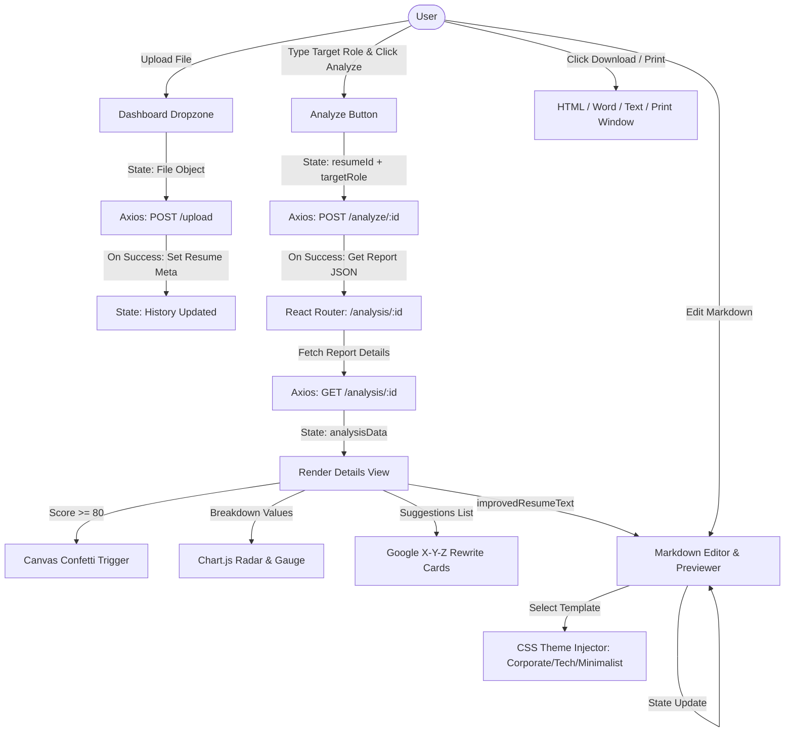

#  SkillMetric Frontend — React 19 & Vite Client Portal

This is the client-side single page web application (SPA) for **SkillMetric**. It features an interactive, dark/light themed, glassmorphic design that handles resume uploads, visualizes ATS grading scores, provides side-by-side markdown comparison editing, and exports files cleanly to PDF, Word, or HTML.

---

##  Technology Stack & Justifications

*   **React 19**: Chosen for its fast reconciliation, hook-based state management, and component architecture. This allows isolated states for complex pages like `AnalysisDetails.jsx` which manages interactive charts, custom dropdown selections, markdown parsers, and printing.
*   **Vite**: The build engine and local dev server. Vite uses native ES modules to compile code in milliseconds, making the developer feedback loop instant compared to legacy Webpack builds.
*   **Tailwind CSS (v4)**: Modern CSS framework. The utility-first strategy enables custom layout responsiveness, custom palettes, CSS variables integration, and effortless transitions directly in the JSX files.
*   **Chart.js & React-Chartjs-2**: Provides responsive HTML5 Canvas charts. Used to render progress meters and radar graphs to display scoring breakdowns visually.
*   **Framer Motion**: A key visual library for high-fidelity animations. Used for page transitions, fade-ins, upload dropzone hover animations, and sliding card lists, making the UI feel premium.
*   **Canvas Confetti**: Triggers a burst of multi-colored confetti particles on screen when a user scores an ATS rating of $\ge 80$.
*   **Lucide React**: Out-of-the-box library containing clean, vector-based iconography matching the application's modern aesthetic.
*   **Axios**: Chosen over standard fetch for HTTP requests. It is configured with global interceptors in `src/utils/api.js` to automatically attach JWT authorization headers from local storage.

---

## Core Views & Pages (`/src/pages/`)

### 1. Register & Login (`Register.jsx` / `Login.jsx`)
*   Provides secure, animated login forms with interactive field validation.
*   Handles backend token storage in `localStorage` to keep the user session persistent.

### 2. Dashboard (`Dashboard.jsx`)
*   Features a custom drag-and-drop file upload zone supporting PDF, DOCX, and TXT files.
*   Shows real-time upload progression spinners.
*   Lists historical resumes and previous reports, providing shortcut access or quick deletion.

### 3. Detailed Analysis View (`AnalysisDetails.jsx`)
*   **ATS Score Gauge**: Circular SVG progress gauge showing the overall match score with color-coding (Green = $\ge 70$, Yellow = $50\text{--}69$, Red = $<50$).
*   **Criteria Breakdown**: Horizontal progress meters showing metrics for formatting, keywords, impact, and structure.
*   **Google X-Y-Z Bullet Suggester**: Highlights specific weak points from the user's resume alongside their optimized alternatives and explanations of the formatting benefits.
*   **Interactive Markdown Editor**: Lets the user edit the AI-generated resume code. Features side-by-side Raw Markdown edit state and live A4 document compilation preview.
*   **Resume Template Engine**: Lets the user switch between three professional designs:
    1.  *Corporate Executive* (Classic professional serif structure, centered header with pipes).
    2.  *Modern Tech* (Modern sans-serif typography, clean left-aligned sections with colored backgrounds).
    3.  *Minimalist Clean* (Minimalist Georgia-font layout, clean dates, subtle headers).
*   **Export Functions**: Integrates direct client-side print options and document downloads (HTML, DOC Word, or plain TXT).

---

##  Client Data & Action Flow

Below is the visual block diagram representing the client state machine and data lifecycle within the React frontend:



---

##  Development Setup & Run Guide

### 1. Prerequisites
Ensure you have **Node.js** (v18 or higher recommended) installed.

### 2. Installation
Navigate to the `/frontend` directory and install the packages:
```bash
npm install
```

### 3. Configure API Connection
The backend server URL is configured in `frontend/src/utils/api.js`:
```javascript
const API = axios.create({
  baseURL: 'http://localhost:5000/api', // Replace with your production server domain in prod
  headers: {
    'Content-Type': 'application/json',
  },
});
```

### 4. Running the Development Server
Launch Vite to run the server locally:
```bash
npm run dev
```
Open your browser to the local address output by the CLI (usually `http://localhost:5173`).

### 5. Compiling for Production
Build the static frontend bundle:
```bash
npm run build
```
This compiles assets into the `/dist` directory which can then be deployed to Netlify, Vercel, or served statically via Express.
